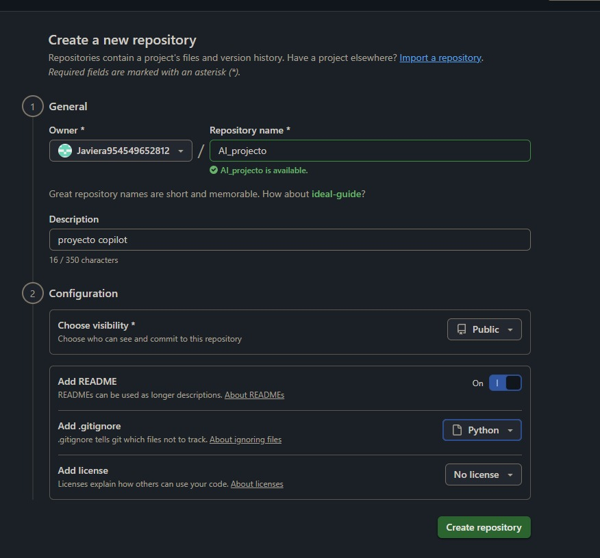
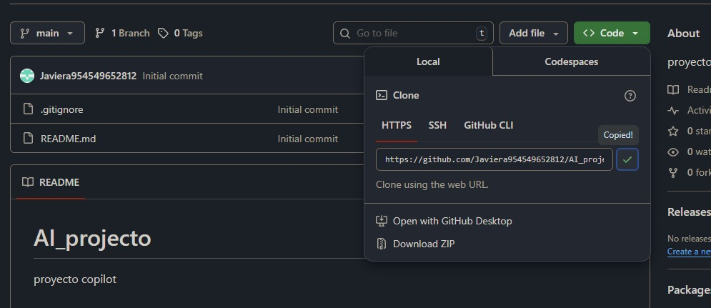
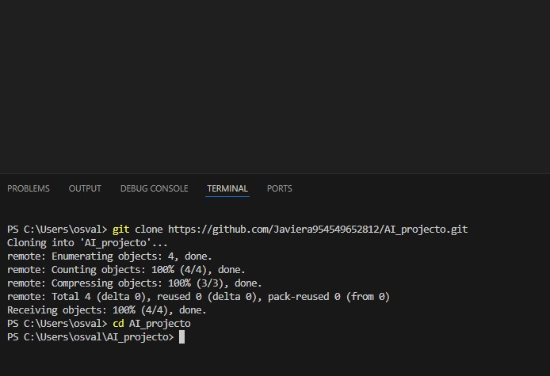
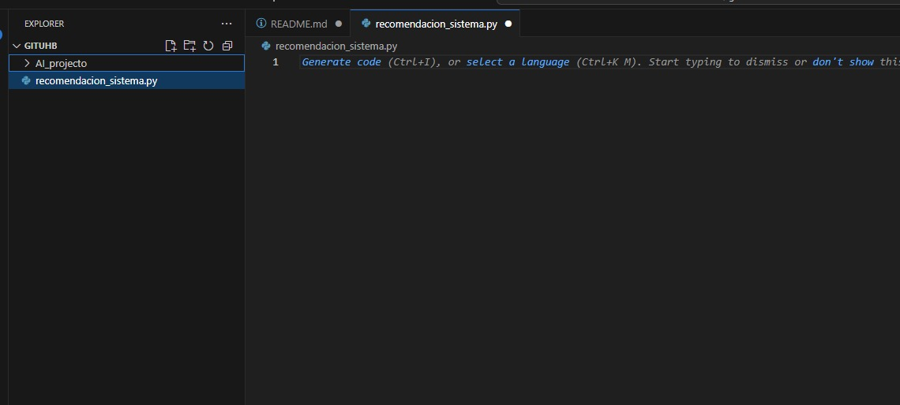
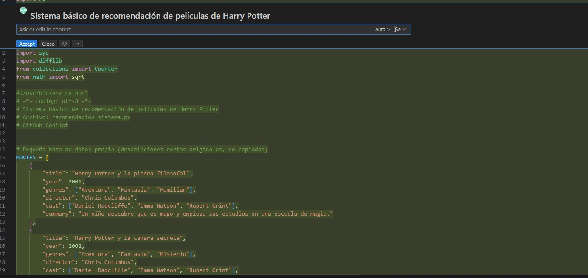
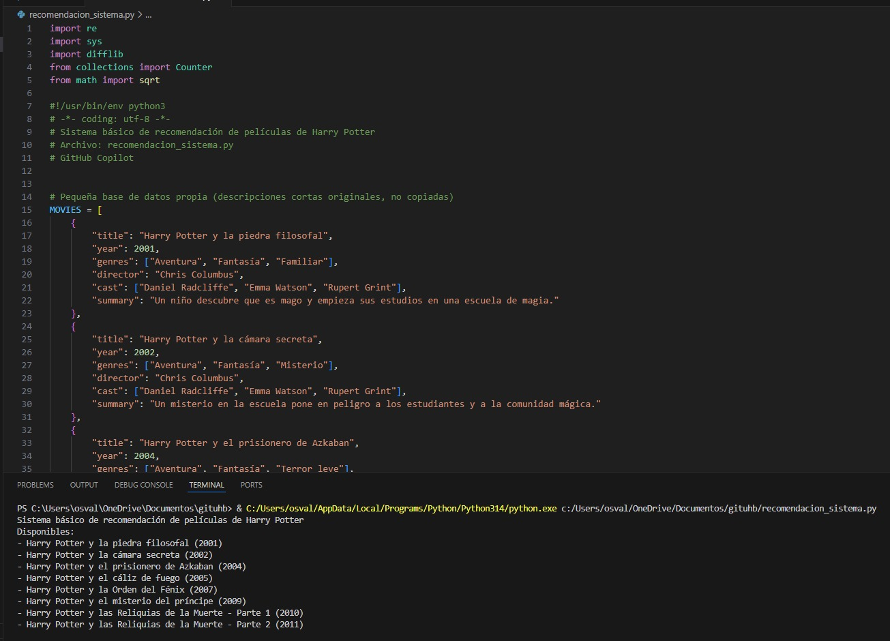
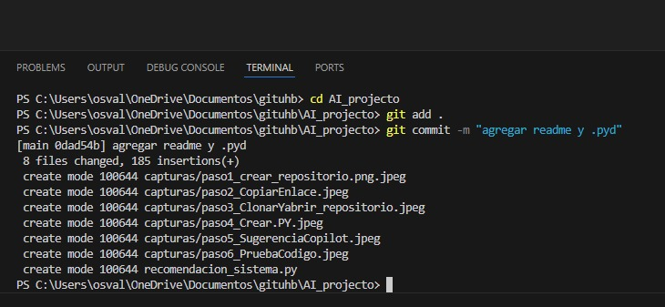
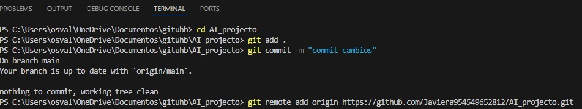
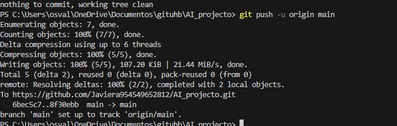

# AI_projecto
proyecto copilot
# Proyecto de Recomendaciones con Copilot
## Pasos realizados

1. Creé el repositorio con nombre **"AI_projecto"**  
   

2. Copié el enlace HTTPS del repositorio.  
   

3. Cloné y abrí el repositorio desde la terminal de Visual Studio Code.  
   

4. Creé el archivo **"recomendacion_sistema.py"** y escribí el código con ayuda de Copilot.  
   

5. Le pedí a Copilot que me sugiriera un código básico de recomendación sobre películas de Harry Potter.  
   

6. Probé el código que me entregó Copilot y funcionó correctamente.  
   

7. Hice commit y add para agregar y guardar los cambios.
   

8. Use el git remote add origin para conectar mi repositorio online con el local.
   

9. Subi los archivos locales a mi repositorio remoto con el git push.
   